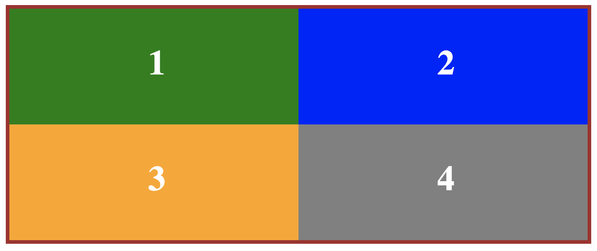

# CSS Positioning Assignment

1. Start a new website project in a directory called css-positioning, and create blank `index.html` and `style.css` files.

2. Write the HTML to create a container `
` with four child `
` elements. Inside each `
`, put an `<h1>` element consisting of a number from 1 to 4. Give the container an `id` of `bento` and give each child `
` a class name of box1, box2, box3 and box4. (The `div` with class name `box1` should contain the number `1` inside, `box2` has `2`, etc.)

3. Set up the look of the page by writing the CSS necessary to:

  - Give `#bento` a 5px solid darkgray border and a `width` of `50em`. Center the `#bento` container `div` on the page.
  - Give all four child boxes a height of 10em and a `width` of `25em`. Set margin to `0` for each of them, too. 
  - Give each child box a different background color of your choice.
  - Style the `<h1>` elements so that the `font color` is `white`, `font size` is `3em`, and `margin` is `0`.
  
4. Now, use the CSS positioning property with appropriate values (static, relative, absolute, fixed) to place the boxes inside `#bento` as follows:

    - box1 should occupy the upper left quadrant of the parent container
    - box2 should be in the upper right quadrant
    - box3, lower left
    - box4, lower right
  
5. Use CSS positioning to center each `<h1>` in the middle of its parent `
`. The final result should look like this, only with whatever colors you choose: 

  
Keep in mind there are multiple ways to go about doing this, different combinations to create the same outcome. There is no one "right" way.
  
6. Push your project to GitHub.
  
7. Share your repo's URL on Slack to "turn in" your assignment.
  
8. **Extra credit:** try to do this assignment again, only this time using [flexbox properties](https://developer.mozilla.org/en-US/docs/Learn/CSS/CSS_layout/Flexbox).
